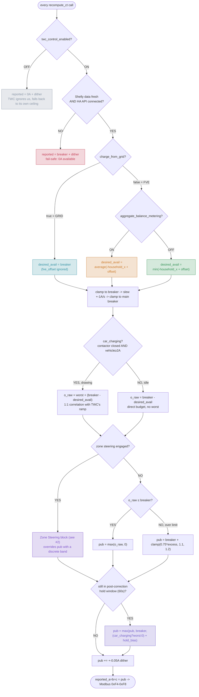
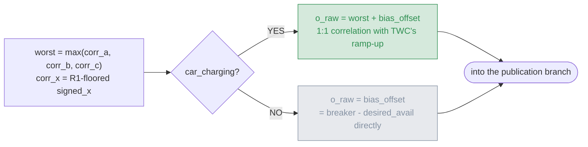
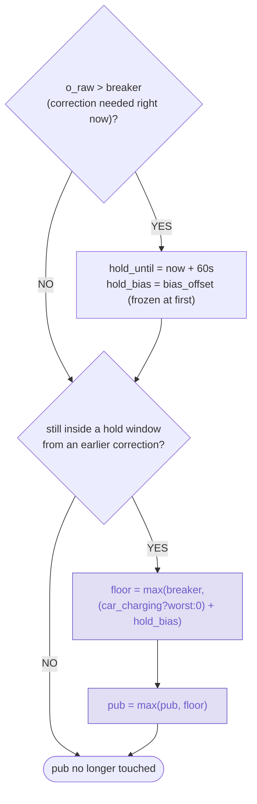
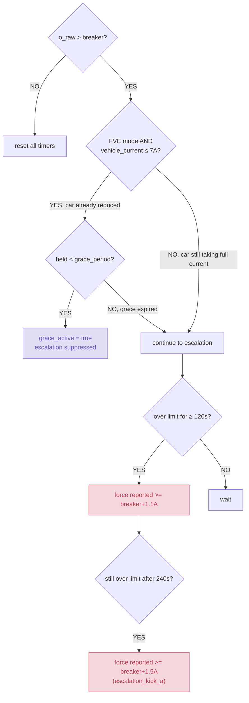
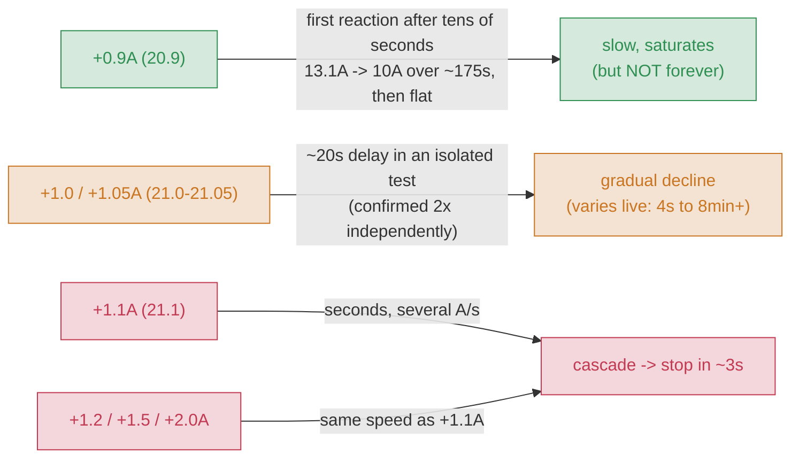
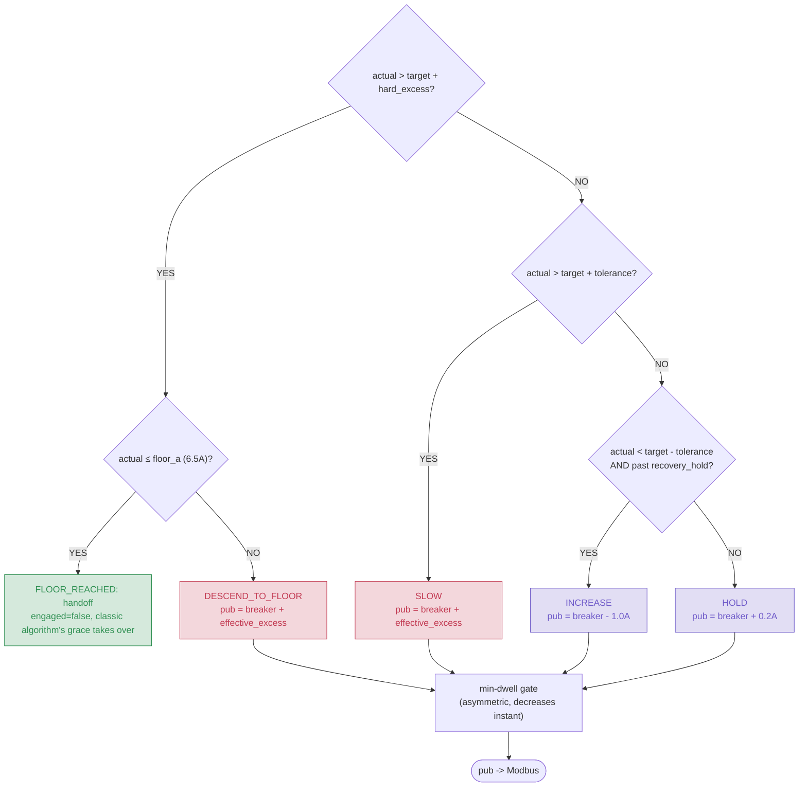

# Decision tree — `recompute_ct`

English reference version of the control algorithm's decision tree —
source: `twc-control.yaml`, branch `master` (merged from `dev` +
`test/zone-steering`). Every branch below is backed by a formula from
the code and, where noted, live-verified numbers from testing sessions
on real hardware.

`twc_breaker_limit_a` = 20.0 A, `main_breaker_limit_a` = 25.0 A (this
project's own `secrets.yaml` values — substitute your own).

## 1. Main decision flow

Every call to `recompute_ct` walks this tree from the top: data
availability and the global kill switch first, then GRID/FVE and
metering-mode selection, and finally the shared publication law that's
identical across all modes.



## 2. Entry conditions

Two guards ahead of any computation, shared by every mode.

- **`switch.*_twc_control_enabled = OFF`**: publishes `0A` (max
  availability) on all 3 phases, deliberately no computation.
  `reported = 0.0 + dither`. TWC3 loses trust in the static value within
  seconds and falls back to its own internal decision-making — this
  intentionally hands the whole session back to stock TWC3 behavior.
- **Shelly stale OR HA API disconnected** (fail-safe): debounced by
  `shelly_unavailable_debounce_ms` (10s) so a brief outage doesn't
  trigger it instantly. `reported = breaker + dither` — 0A availability
  reported, the safe side, no charging on stale/missing data.

## 3. Budget selection — GRID vs. FVE, aggregate vs. per-phase

Three independent paths to `desired_avail` — how much the car is
allowed to take — before any shared post-processing (slew, main
breaker).

**GRID mode** (`charge_from_grid = true`): household balance is
ignored entirely — the car gets the maximum either breaker allows.
`desired_avail = twc_breaker_limit_a` (fve_offset ignored).

**FVE · aggregate/net metering** (`aggregate_balance_metering = ON`):
the utility nets import/export across all 3 phases together for
billing — average of the household-only signal.
`desired_avail = ((-household_a + offset) + (-household_b + offset) + (-household_c + offset)) / 3`.
Live-verified example: real A/B/C 8.71/8.00/8.53A, household A/B/C
−8.00/−8.00/−8.20A → `desired_avail = 7.85A`.

**FVE · per-phase metering** (default, `aggregate_balance_metering =
OFF`): the utility settles each phase separately — the weakest
exporting phase is the real constraint.
`desired_avail = min(-household_a + offset, -household_b + offset, -household_c + offset)`.
Live-verified example: real A/B/C 1.51/0.89/1.34A, household A/B/C
−1.00/−0.00/−1.20A → `min(1.00, 0.00, 1.20) = 0.73A`.

Note: `household_x = signed_x − vitals_current_x` (the vehicle's own
current subtracted out via TWC3's own vitals API — a household-only
signal, no R1 floor on this input). `signed_x` is `floor()`-rounded
downward on export, so surplus never overshoots reality.

Common post-processing across all three branches:

```
desired_avail = min(desired_avail, breaker)                                   // ceiling
desired_avail = slew(desired_avail, up 10A/s / down 1A/s)                     // NaN-bypass on the first cycle after boot
desired_avail = min(desired_avail, main_breaker − max(real_a, real_b, real_c)) // main breaker, immediate, never delayed
```

## 4. Publication law — `car_charging` decides correlation

Here `desired_avail` becomes the actual value for Modbus. The key
fork: whether `worst` (the real, vehicle-inclusive current) is part of
the formula depends on whether the car is actually drawing current.



**Why `worst` disappears while idle**: while the car isn't drawing
(`car_charging=false`) there's nothing to correlate — adding `worst`
would double-subtract the household's own draw (already excluded in
`household_x`). Live-verified: `desired_avail = 2.68A`,
`bias_offset = 20 − 2.68 = 17.32A`, `o_raw (car_charging=0) = 17.32A`.

**Why `worst` must be there while charging**: TWC3 compares `reported`
against its own measurement of the ramping current — a static or
unshifted value during a real ramp = loss of trust in the meter.
Live-verified (6kW export): `worst (vehicle drawing) = 8.20A`,
`bias_offset = 20 − 7.85 = 12.15A`, `o_raw (car_charging=1) = 4.15A`.

**Final `pub` value:**

```
o_raw <= breaker:  pub = max(o_raw, 0)                       // floored at 0, never negative
o_raw >  breaker:  excess = clamp(0.75 * (o_raw - breaker), 1.1, 1.2)
                    pub = breaker + excess                    // 1.1A floor, not 0.1 — see §8
```

## 5. Post-correction hold — anti-oscillation

Without this mechanism, `pub` immediately fell back after a
correction, the car ramped straight back up, and the contactor cycled
in a ~1-2s loop. The hold keeps `pub` at the limit for 60 seconds after
the last correction — but **correlation-safe**, tracking `worst` in
real time rather than as a flat constant.



|  | before (static constant) | after (worst-tracking) |
|---|---|---|
| vitals_vehicle | 8A → 10A (ramp) | 8A → 10A (ramp) |
| pub | pinned at exactly 20.0A | 20.4 → 22.0A, tracks 1:1 |
| result | TWC3 lost trust, stopped at 4.7kW surplus | correlation preserved |

`hold_bias_offset` no longer stays frozen for the whole hold window —
it tracks any *improvement* via `std::min` once `o_raw` drops back
under the limit but the hold window is still active, so the fast
recovery slew (§3) isn't wasted for the rest of the window.

Once the hold window expires, it releases **immediately** to the
natural value — no further rate-limiter on top (the original
`0.1A/s` crawl was removed: maximizes surplus use, the hold alone is
enough to stop contactor cycling).

## 6. Grace period and escalation

A secondary safety net beyond the publication law — what to do when a
deficit persists. Grace never touches `o_raw`/`pub` directly (that
would defeat the regulation loop); it only suppresses escalation once
it's clear the car has already reacted.



**Two discarded attempts before this design**: (1) floor
`desired_avail=5A` — didn't work, `worst` (the car's real current) was
already higher; (2) cap `pub` exactly at the breaker limit — killed
regulation entirely, the car kept drawing from the grid with no
downward pressure. **Fix**: grace never touches `o_raw`/`pub` — it only
suppresses escalation (both stages) once `vitals_vehicle ≤ 7A` (raised
from an original 5.5A, since the real measured minimum was ~6A).

**Stage 1 / Stage 2**: `capped_since_ms` runs continuously from the
first moment `o_raw > breaker` — the grace timer doesn't restart it,
only skips the actual forcing.

| stage | condition | forced value |
|---|---|---|
| Stage 1 (2 min) | over limit continuously | `reported >= breaker + 1.1A` |
| Stage 2 (4 min) | still over limit | `reported >= breaker + 1.5A` |

## 7. Input filters (outside `recompute_ct`)

Run before the main logic, in the Shelly sensors' `on_value` handlers.

- **Anti-glitch firewall (asymmetric)**: a rise in real current is
  trusted immediately. A sudden drop ≥ `3.0A` is held at the last
  trusted value until 2 consecutive samples agree within `1.0A`.
- **R1 hard floor (correlation only)**: while `car_charging=true`,
  `corr_x = max(signed_x, vitals_current_x)`. Applied only to the
  correlation signal, never to `household_x` (see §4).

## 8. Threshold-probe: TWC3's measured reaction curve

Branch `test/threshold-probe` adds a manual switch
(`switch.*_threshold_test_mode`) and a number field
(`number.*_test_reported_current_a`) that directly override the
published value — letting the real TWC3 reaction to an exact
`reported` value be measured directly, instead of inferred from the
natural noise of the regulation loop.

`twc_breaker_limit_a` = 20A. **The reaction is not a sharp on/off
threshold** — it behaves like a time-integrated/cumulative response:
every tested value above the limit *eventually* causes a reduction
given enough time; there is no value that holds forever. How fast it
reacts (and how far it goes before plateauing) depends heavily on how
far past the limit it sits.



| pub (breaker+X) | reaction | note |
|---|---|---|
| +0.9 A (20.9) | slow, saturates — but not indefinitely | 13.1A→10A over ~175s, plateaus, but held longer it resumes declining (10A→11A→10A over a further ~80-175s) |
| +1.0 / +1.05 A | ~20s delay in isolation, then gradual decline | does **not** generalize to dynamic conditions — one live stop happened after only ~4s (actual already low, less room to the floor); another sustained 8+ minutes of continuous holding (actual stabilized just above the floor, a real small deficit) before TWC3 aborted anyway |
| +1.1 A | seconds, cascading | full stop in ~3s; nudging back to 21.0 mid-cascade did **NOT** stop the decline |
| +1.2 / +1.5 / +2.0 A | same speed as +1.1A | reaction saturates, going higher adds nothing |

**Key finding**: there is no "safe forever" value — even +0.9A
eventually reduces, and the ~20s grace measured for +1.0A in an
isolated static test does **not** reliably generalize: reaction speed
appears genuinely cumulative/duration-sensitive, not a fixed delay,
and depends on how much headroom the car's actual current has left
before the floor.

**Recovery**: reducing the mid-cascade test value from 21.1 back to
21.0 did **not** stop a cascade already in progress — the car kept
declining to a full stop regardless. Only fully turning `threshold_test_mode`
**off** (returning to the natural, low published value) let the car
recover from a partial drop (e.g. 6A) instead of continuing to a full
stop.

**Practical implication — the motivation for Zone Steering (§9)**:
there is no single excess value that's simultaneously "fast enough to
react to a real deficit" and "gentle enough to never overshoot into a
stop." Instead of one continuous value: a sequence of discrete bands,
plus escalation driven by elapsed time, not just by the size of the
excess.

## 9. Zone Steering — discrete bands for graceful de-escalation

Branch `test/zone-steering` (merged into `dev` and `master`) — instead
of one continuous `excess` value (§4), publishes one of 4 discrete
bands relative to `twc_breaker_limit_a`, chosen by comparing the
vehicle's **actual** current (`twc_vitals_vehicle_current`) against
`desired_avail` (the target). Only engages when the classic law would
already be publishing at/above the limit while charging.

TWC3's own live plausibility/correlation check on `reported` (comparing
it against its own ramping current, see §4) appears to only really be
active during the initial charging ramp-up. Once the limit is reached
and zone steering takes over, that check doesn't seem to be a factor
anymore — behavior at that point is driven purely by the reaction-curve
timing in §8. Not confirmed as a hard rule yet, but consistent with
everything observed so far, and part of why zone steering can safely
hold a fixed band value for multiple seconds at a time without
triggering a correlation-distrust stop the way a static value would
during ramp-up (§5).



**Auto-engage / latch**: engages the instant the classic computation
would have published `>= twc_breaker_limit_a` while charging — not
tied to a manual switch or timing. Stays engaged through normal
fluctuation; disengages only on `FLOOR_REACHED` handoff or
`!car_charging`; re-engages fresh on the next threshold hit.

**Floor + immediate handoff**: the original design had a separate
FLOOR_HOLD state with its own grace timer. Live-confirmed: `actual`
could stabilize just *above* the floor (a real, small, sustained
deficit) for 8+ minutes without ever escalating or handing off — TWC3
aborted anyway. Fix: the instant the floor is reached, zone steering
disengages immediately and hands off to the classic algorithm's own
grace mechanism instead of maintaining a separate state.

**Stuck-timeout escalation**: a safety net for the case where the
floor is never actually reached. If braking has been continuously
needed for longer than `zone_steering_stuck_timeout_s` (default 60s,
range 5-900s) without real progress (a genuine >0.3A decrease from
baseline), SLOW/DESCEND_TO_FLOOR escalate to the confirmed-fast
`+1.1A` instead of holding the weaker brake value indefinitely.

**Gentler braking near the floor**: live-confirmed, the same `+1.0A`
caused a stop after only ~4s (not ~20s) when `actual` was already
low — less headroom before the floor. Below
`zone_steering_low_current_threshold_a` (8A), a gentler
`zone_steering_slow_brake_excess_a` (0.9A) is used instead of the
normal 1.0A.

**Minimum-dwell gate**: live-confirmed, `desired_avail`'s fast
recovery slew combined with a tight tolerance could make the target
jitter across a band boundary several times per second, and every flip
reset TWC3's own internal "sustained excess" timer — so a correction
never ran long enough uninterrupted to have any effect. The gate holds
the last **published** value sticky for at least `zone_steering_min_dwell_s`
(default 3s) before accepting an escalation to a firmer band.
Asymmetric: a decrease (easing off) is always accepted instantly,
matching the "rises trusted immediately, only firming up needs
caution" pattern used throughout this design (anti-glitch firewall, R1
floor, the release logic in §5) — only an *increase* in severity is
dwell-gated.

**Recovery-hold cooldown**: blocks INCREASE for
`zone_steering_recovery_hold_s` (default 10s) after any braking cycle,
falling through to HOLD instead — live-confirmed, without it a brief
dip of `actual` just under `target` right after a correction triggered
an immediate ramp back up, undoing the correction just made.

| entity (number/switch/binary_sensor) | default | role |
|---|---|---|
| `switch.*_zone_steering_mode` | ON | master switch for the whole mechanism |
| `binary_sensor.*_zone_steering_engaged` | — | is zone steering active right now vs. the classic algorithm |
| `zone_steering_tolerance_a` | 0.5 A | deadband around target for SLOW vs. HOLD |
| `zone_steering_hard_excess_a` | 3.0 A | deadband before the HARD band |
| `zone_steering_floor_a` | 6.5 A | where steering hands off to the classic algorithm |
| `zone_steering_low_current_threshold_a` | 8.0 A | below this, braking is gentler |
| `zone_steering_slow_brake_excess_a` | 0.9 A | gentler excess below the low-current threshold |
| `zone_steering_recovery_hold_s` | 10 s | blocks INCREASE right after braking |
| `zone_steering_min_dwell_s` | 3 s | minimum time between pub escalations (asymmetric) |
| `zone_steering_stuck_timeout_s` | 60 s (5-900) | escalates to +1.1A when no progress is made |

## 10. Constants reference

| constant | value | note |
|---|---|---|
| `twc_breaker_limit_a` | 20.0 A | `secrets.yaml`, TWC3 installer app value |
| `main_breaker_limit_a` | 25.0 A | physical main breaker, clamped instantly |
| `excess_gain` | 0.75 | compression of the over-limit excess |
| `excess_max_a` | 1.2 A | compression ceiling |
| `law_nudge_min_a` | 1.1 A | raised from 0.1 — confirmed TWC3 reaction margin |
| `desired_avail_slew_down_a_per_s` | 1.0 A/s | decline throttled (protective) |
| `desired_avail_slew_up_a_per_s` | 10.0 A/s | recovery treated as instant/protective |
| `post_correction_hold_ms` | 60,000 ms | 1 minute, worst-tracking floor |
| `grace_vitals_threshold_a` | 7.0 A | "car near minimum" detection |
| `number.*_low_surplus_grace_period` | 12 s (default, HA) | runtime-adjustable |
| `escalation_timeout_ms` | 120,000 ms | stage 1 at 2×, stage 2 at 4× |
| `escalation_kick_a` | 1.5 A | stage 2 hard kick |
| `dither_amplitude_a` | 0.05 A | always active, including fail-safe |
| `glitch_drop_a` / `confirm_tol_a` | 3.0 A / 1.0 A | anti-glitch firewall |
| `shelly_unavailable_debounce_ms` | 10,000 ms | before fail-safe |
| `car_charging` threshold | `vehicle_current` ≥ 2.0 A | + contactor closed |

---
*esphome-twc-control · `recompute_ct` decision tree · source: `twc-control.yaml`, branch `master`*
